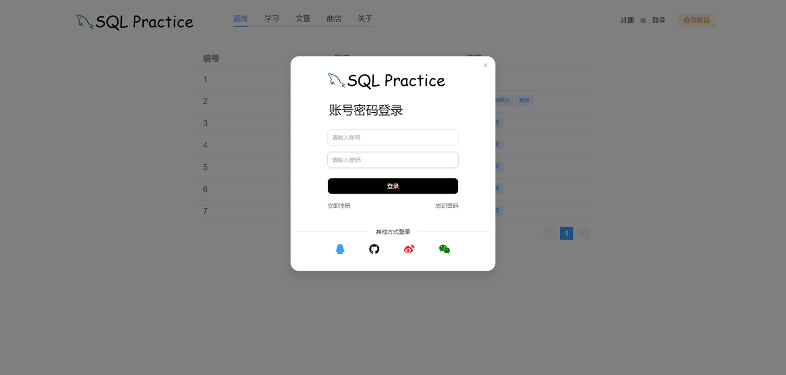
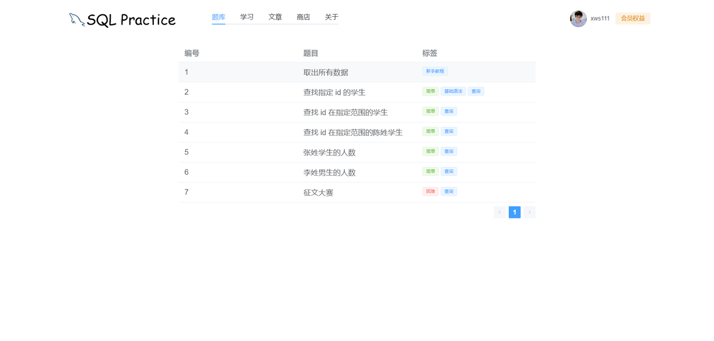
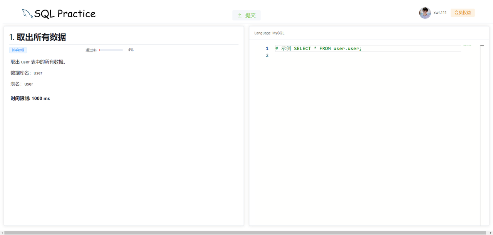
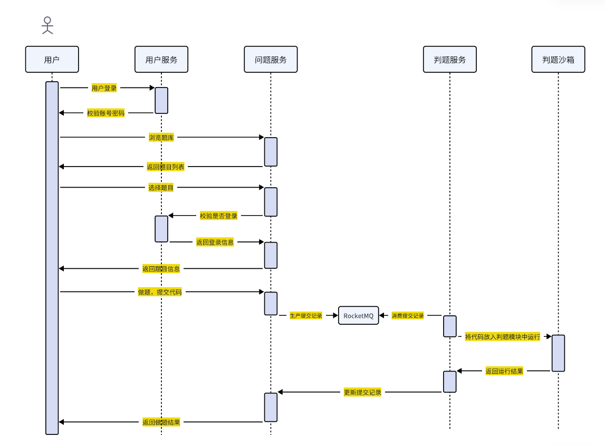

### 项目背景
1. 数据库是 Java 开发的重中之重。
2. 对于大部分 CV 工程师而言，刷的算法可能一辈子都用不上，但是数据库是每天都要接触的。
3. 市面上的算法练习平台，如牛客、力扣等非常完善，而数据库练习平台几乎没有。牛客、力扣虽然有一些习题，但是题目很少且不太深入，显然不是他们的主力产品。
4. 国外的数据库练习平台也不完善，界面简陋，最主要的是全英文的界面是对国人并不友好。
   基于以上几点，本项目开发了一个 web 端的数据库练习平台，从实际出发，循序渐进地带领用户体会 MySQL的设计之精妙。
### 项目简介
基于 Springboot2 + Vue3 开发的前后端分离项目。
核心功能：
 1. 用户进行基本的查询练习
 2. 用户进行多表的查询练习
 3. 用户进行海量数据的 SQL 优化练习
### 页面预览

### 核心业务时序图

### 项目环境
- Java 1.8
- Springboot 2.6.13
- Maven 3.9.8
- MySQL 8.0
- Vue3

### 项目技术选型
- 经典 SSM 框架
- Nacos 作为负载均衡和配置中心
- Openfeign 服务远程调用
- RocketMQ 作为判题队列
- Redis 作为共享 Session 的分布式登录解决方案
- 搭载 CI/CD 自动容器化构建、测试、部署。